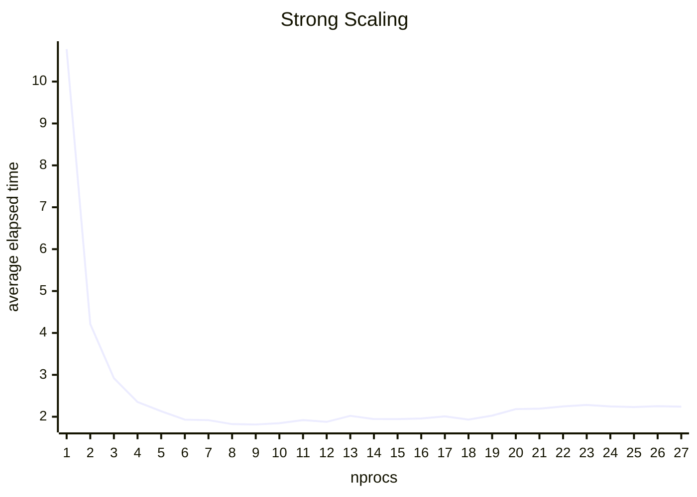
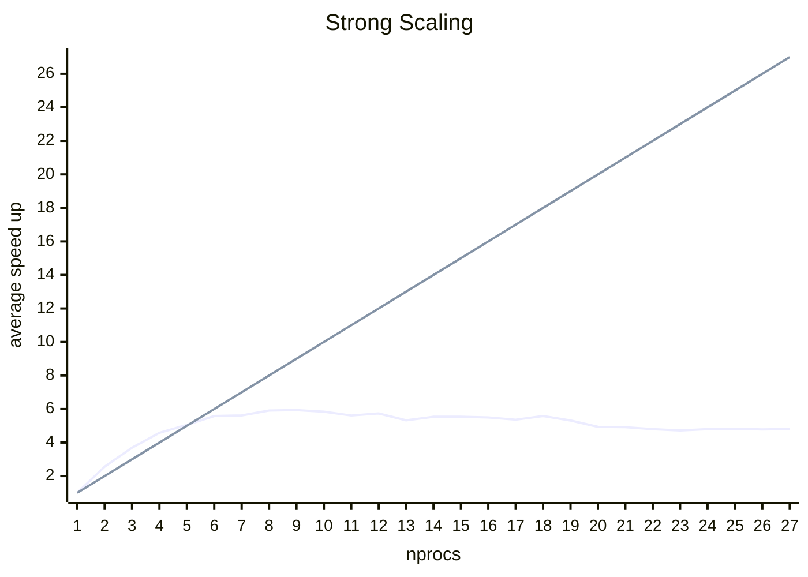
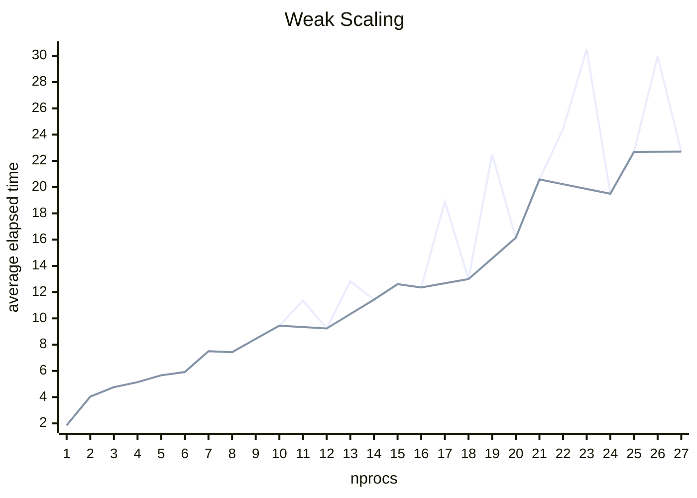

# Domain Decomposition

Domain decomposition splits the simulation up in 3D space and allocates each processor a region to oversee.

## Scaling

### Strong

> 100k particles, 0.05 cutoff, O3 optimisation, average of 10 results

> 100k particles, 0.05 cutoff, O3 optimisation, average of 10 results

### Weak

> 50k particles per processor, 0.05 cutoff, O3 optimisation, average of 10 results. The straighter line ignores any `nprocs` value in which the cutoff was wider than any of the domains.